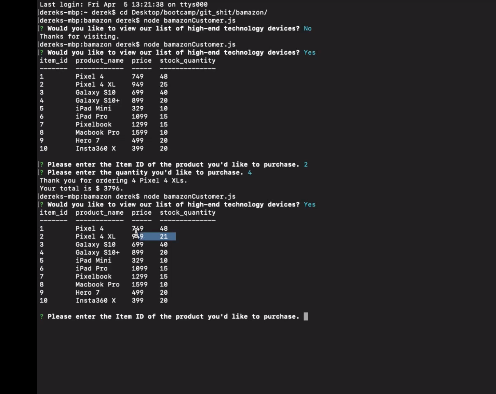

# Bamazon - Node.js & MySQL

## Overview

GitHub repo:
https://github.com/derekgeorg/bamazon.git

Video file in Google Drive
https://drive.google.com/file/d/1BRyA_zZ9yIxSUgZN_YKe24NLLI2s4wDs/view?usp=sharing

This project was created using Node.js & MySQL and must be run in the terminal.

The application prompts a user on whether or not they would like to view our list of high-end technology devices.

If the user selects "N" for No, "Thanks for visiting" is returned.

If the user selects "Y" for Yes, they are given a list including item_id, product_name, price and stock_quantity.

They are then prompted to enter the Item Id of the product they'd like to purchase.

And then the quantity.

The Item Id of the product previously selected, along with the total price, based on the item price and the quantity selected, are returned.

The quantity the user selects is reduced from the stock_quantity in the MySQL db.

### Learned:
* Node
* MySQL Database 
* Schema creation
* Inquirer

